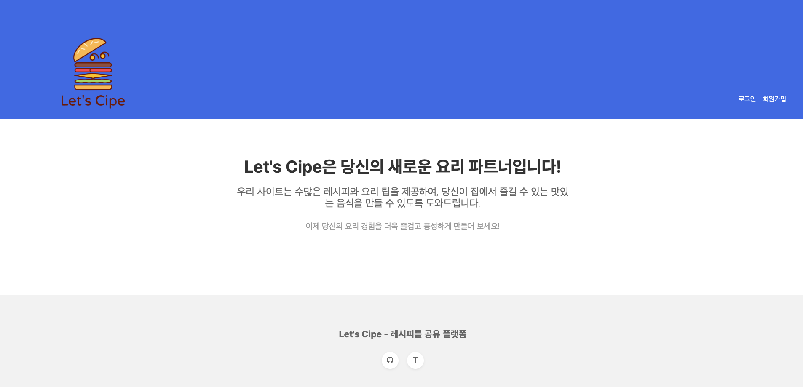
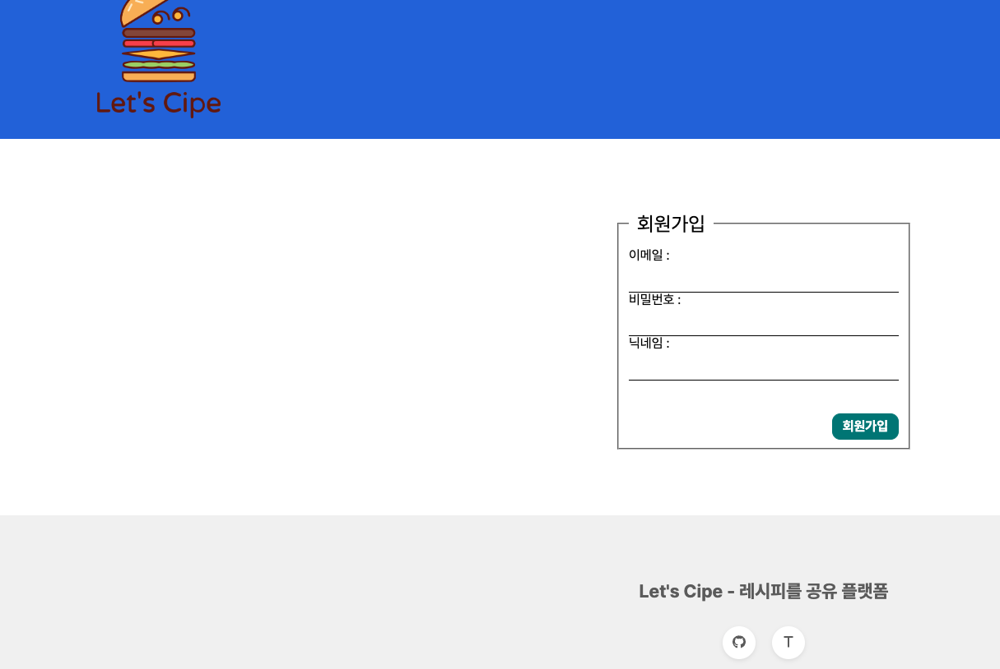
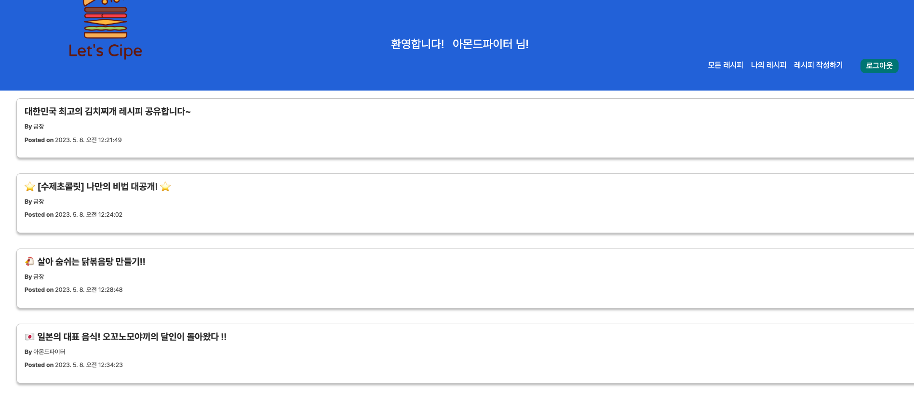
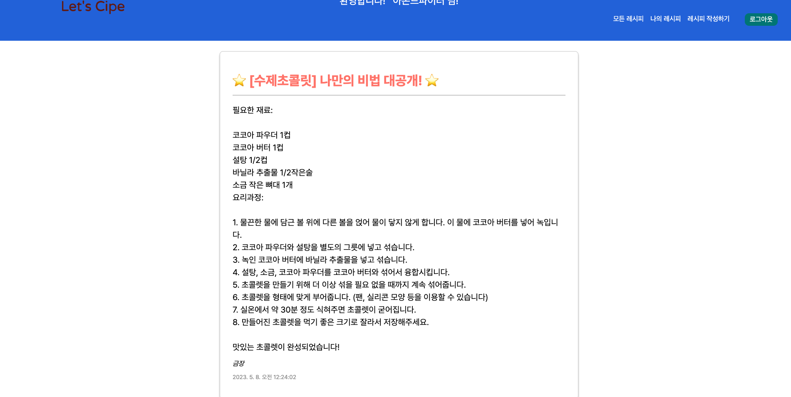
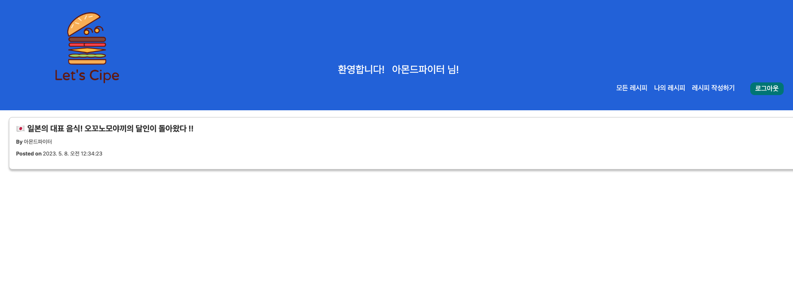

# Let's Cipe - 레시피 공유 플랫폼

### 1. 프로잭트 소개

나의 레시피를 기록하고 공유 하며 다른 사람들의 레시피까지 공유 받을 수 있는 플랫폼이다.

추후 본인의 레시피의 음식을 판매, 다른 사람의 음식을 구매 하는 기능까지 구현하는 것이 목표이다.

---

### 2. 배포 링크

https://lets-cipe.web.app/

---

### 3. 팀 소개
소프트웨어학과 20181637 안금장

---

### 4. 사용법

<h2>메인 화면</h2>

처음 사이트에 접속했을 때 나오는 메인화면이다. 

<h2>회원가입 </h2>

Firebase의 Authentication을 이용하여 회원가입, 로그인, 로그아웃을 구현하였다.

<h2>모든 레시피</h2>

나를 포함한 모든 사람들이 공유한 레시피를 볼 수 있다.

<h2>세부 레시피 정보</h2>

레시피의 세부사항을 볼 수 있다.

<h2>내가 공유한 레시피</h2>

내가 공유한 레시피만 모아 볼 수 있다.

### 5. 기타

웹 클라이언트컴퓨팅 수업을 들으며 React로 화면 구성을 하며 Firebase를 이용해 Authentication과 Database를 연동하고 배포까지 하였다.

그동안 백엔드 프레임워크만 사용해보았는데 이번 기회에 처음으로 React를 사용할 수 있어서 프론트엔드의 기본적인 동작방식을 배울 수 있었던 것 같다.

또한 Google 의 Firebase가 서버 없이도 이용할 수 있다는 점이 무척 매력있었고 배포까지도 간편하게 할 수 있다는 점이 정말 큰 장점 같았다.